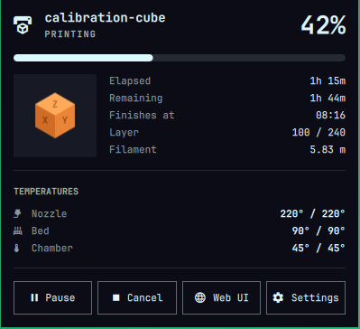
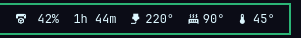
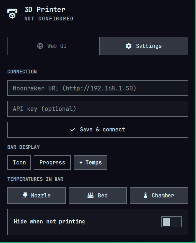
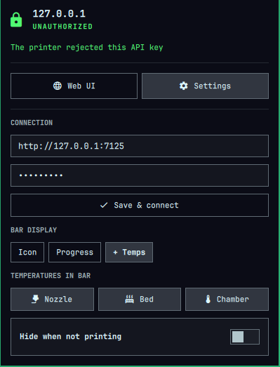
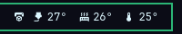

# Moonraker Printer for Omarchy

A bar widget for the [Omarchy](https://omarchy.org) shell that shows the status
of any Klipper 3D printer running [Moonraker](https://github.com/Arksine/moonraker):
Qidi (tested on a Q2), Voron, RatRig, Creality K-series with Klipper, and others.

<p align="center">
  
</p>
<p align="center">
  
</p>

## Features

- **Bar chip** in three styles: icon only, progress + time left, or progress + temperatures
- **Detail popup**: thumbnail, elapsed/remaining time, finish time, layer, filament, live temperatures
- **Controls**: pause, resume, and cancel (cancel asks you to confirm)
- **Every printer state is covered**: setup, unreachable, bad API key, Klipper
  starting/shutdown/disconnected, idle, heating, printing, paused, complete,
  cancelled, and error. See [docs/STATES.md](docs/STATES.md).
- **API key support**: works over a VPN or anywhere the printer doesn't trust your IP
- **Native look**: colors, font, borders, and controls come from the Omarchy
  shell, so the widget follows `omarchy theme set` like the built-in widgets
- **No dependencies**: talks to Moonraker over HTTP from QML, with no curl or scripts

## Install

```bash
omarchy plugin add https://github.com/prodpixa/omarchy-moonraker.git --enable
```

Or manually:

```bash
git clone https://github.com/prodpixa/omarchy-moonraker.git ~/.config/omarchy/plugins/pixa.moonraker
omarchy-shell shell rescanPlugins
omarchy plugin enable pixa.moonraker right
```

Then click the printer icon in the bar. The popup opens on the Settings form.
Enter the Moonraker URL (and the API key if your printer needs one), then click
**Save & connect**.

<p align="center">
  
  &nbsp;
  
</p>

### Finding the API key

- Mainsail / Fluidd: *Settings → Authorization → API key*
- From a machine the printer already trusts: `curl http://<printer>/access/api_key`

The key is only needed when Moonraker doesn't trust your address, e.g. over a
VPN or from another subnet. On the same LAN many printers work without one.

## Using it

| Action        | Result |
|---------------|--------|
| Left click    | Open or close the detail popup |
| Right click   | Cycle the bar style: icon → progress → progress + temps |
| Middle click  | Open the printer's web UI (Mainsail/Fluidd) in your browser |
| `r` / `s` / `o` in the popup | Refresh / toggle settings / open the web UI |
| `Esc`         | Close the popup |

### Bar styles

| Style | Example |
|-------|---------|
| `icon` |  |
| `progress` |  |
| `full` |  |
| `full` while idle |  |

When the printer is offline the icon dims and changes to a network-disconnect
glyph. Auth problems show a lock. Klipper problems and print errors switch the
chip to your theme's urgent color.

## Configuration

The Settings section in the popup writes these values to the widget's entry in
`~/.config/omarchy/shell.json`. You can also edit that file by hand:

```json
{
  "id": "pixa.moonraker",
  "url": "http://192.168.1.50",
  "apiKey": "",
  "display": "full",
  "temps": ["nozzle", "bed", "chamber"],
  "pollInterval": 5,
  "hideWhenIdle": false,
  "hideWhenOffline": false,
  "chamberObject": ""
}
```

| Key               | Default             | Description |
|-------------------|---------------------|-------------|
| `url`             | —                   | Moonraker address. `http://` is added when missing. Include the port if it isn't 80, e.g. `http://printer.local:7125`. |
| `apiKey`          | `""`                | Sent as the `X-Api-Key` header. |
| `display`         | `progress`          | `icon`, `progress`, or `full`. |
| `temps`           | `["nozzle","bed"]`  | Temperatures shown in `full` style: `nozzle`, `bed`, `chamber`. |
| `pollInterval`    | `5`                 | Seconds between refreshes (2–120). Capped at 3 s while printing or while the popup is open. |
| `hideWhenIdle`    | `false`             | Show the widget only while a print is running or paused. |
| `hideWhenOffline` | `false`             | Hide the widget while the printer can't be reached. |
| `chamberObject`   | auto                | Klipper object for the chamber temperature, e.g. `temperature_sensor chamber`. Detected automatically when empty. |

The API key is stored in plain text in `shell.json`, like every other Omarchy widget setting.

## Scripting (IPC)

```bash
omarchy-shell pixa.moonraker toggle          # open/close the popup
omarchy-shell pixa.moonraker showSettings    # open the popup on the settings form
omarchy-shell pixa.moonraker refresh         # poll now
omarchy-shell pixa.moonraker cycleDisplay    # next bar style
omarchy-shell pixa.moonraker status          # JSON snapshot (never includes the API key)
omarchy-shell pixa.moonraker configure '{"url":"http://printer","display":"full"}'
```

`status` output:

```json
{
  "configured": true, "online": true, "auth": true, "klippy": "ready",
  "state": "printing", "file": "benchy.gcode", "progress": 0.42, "remaining": 6720,
  "temps": {
    "nozzle": {"key": "nozzle", "temperature": 219.6, "target": 220},
    "bed": {"key": "bed", "temperature": 60.1, "target": 60}
  },
  "error": ""
}
```

The real output is a single line.

## Troubleshooting

| Popup says | Meaning / fix |
|------------|---------------|
| *Not configured* | No URL set. Open Settings. |
| *Unreachable — No response from …* | Wrong address or port, the printer is off, or the VPN is down. Try the URL in a browser. |
| *Unauthorized — This printer requires an API key* | Moonraker doesn't trust your IP. Add the API key. |
| *Unauthorized — The printer rejected this API key* | The key is wrong or was regenerated. |
| *Klipper disconnected / shutdown / starting up* | Moonraker is fine, Klipper isn't. Check the printer's screen or web UI. The message from Klipper is shown under the title. |
| No chamber temperature | Set `chamberObject` to the right Klipper object (see `/printer/objects/list`). |
| No thumbnail | The slicer didn't embed one, or Moonraker didn't extract it. |

## Documentation

- [docs/STATES.md](docs/STATES.md): every state with screenshots
- [docs/ARCHITECTURE.md](docs/ARCHITECTURE.md): how the widget works internally and which Moonraker APIs it calls
- [docs/TESTING.md](docs/TESTING.md): mock printer, screenshot automation, and a manual test checklist
- [docs/README.pl.md](docs/README.pl.md): the same overview in Polish

## License

MIT, see [LICENSE](LICENSE).
